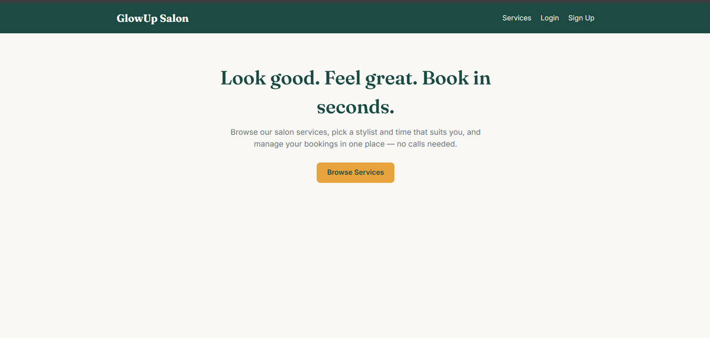
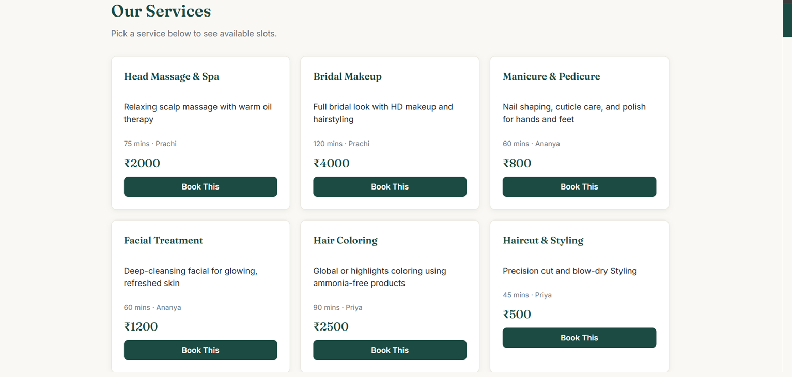
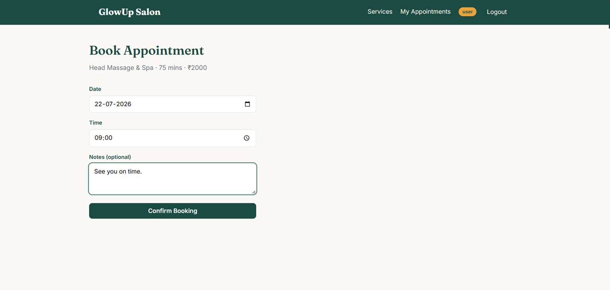
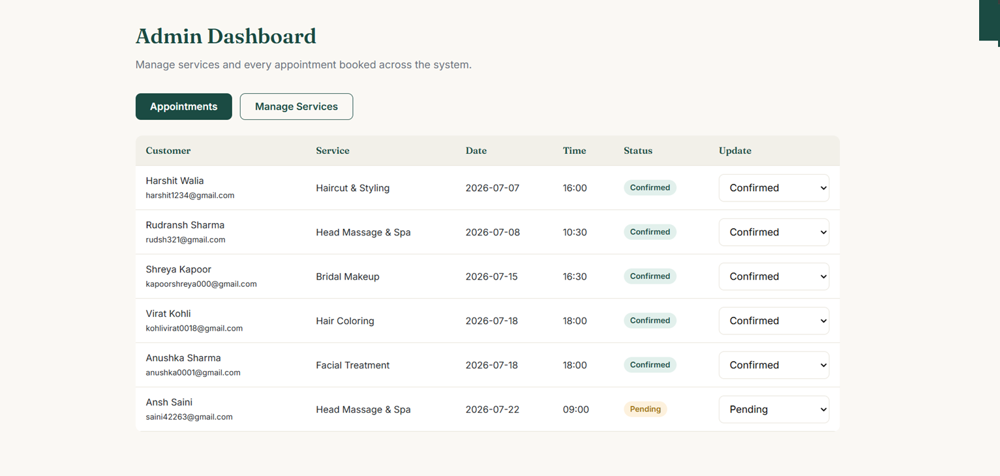

# QuickBook — Appointment Booking System (MERN Stack)

A full-stack appointment booking web application built for [college/course name — add yours here].
Customers can browse available services and book appointment slots; admins can manage
services and view/update all bookings.

**Live Repository:** https://github.com/AkhilOO18/appointment-booking-system

---

## Tech Stack

| Layer | Technology |
|---|---|
| Frontend | React (Vite), React Router, Axios |
| Backend | Node.js, Express.js |
| Database | MongoDB (Mongoose) |
| Auth | JWT (JSON Web Tokens), bcrypt for password hashing |

---

## Screenshots

**Homepage**


**Browse Services**


**Book an Appointment**


**Admin Dashboard**


---

## Features

- User registration and login with JWT-based authentication
- Role-based access control — the first registered user automatically becomes an **admin**
- Customers can browse services and book available appointment slots
- Customers can view and track their own appointments
- Admins can add/manage services and update appointment status (e.g. Confirmed, Completed)
- Passwords are hashed with bcrypt — never stored in plain text
- Protected API routes secured with JWT middleware

---

## Project Structure

```
appointment-booking-system/
├── backend/
│   ├── config/          # Database connection
│   ├── middleware/       # JWT auth middleware
│   ├── models/           # User, Service, Appointment schemas
│   ├── routes/           # Auth, Service, Appointment routes
│   └── server.js
├── frontend/
│   └── src/
│       ├── api/          # Axios instance (auto-attaches auth token)
│       ├── components/   # Navbar, ProtectedRoute
│       ├── context/       # Auth context
│       └── pages/         # Home, Login, Register, Services, BookAppointment, MyAppointments, AdminDashboard
├── screenshots/
└── README.md
```

---

## Getting Started (Local Setup)

### Prerequisites
- [Node.js](https://nodejs.org) (LTS version)
- A MongoDB database — either [MongoDB Atlas](https://www.mongodb.com/cloud/atlas) (free, cloud-hosted, recommended) or a local MongoDB install

### 1. Clone the repository
```bash
git clone https://github.com/AkhilOO18/appointment-booking-system.git
cd appointment-booking-system
```

### 2. Backend setup
```bash
cd backend
npm install
cp .env.example .env
```
Open `.env` and add:
- `MONGO_URI` — your MongoDB connection string
- `JWT_SECRET` — any random long string

Run the server:
```bash
npm run dev
```
Server runs at `http://localhost:5000`.

### 3. Frontend setup
In a new terminal:
```bash
cd frontend
npm install
npm run dev
```
App runs at `http://localhost:5173`.

---

## Demo Walkthrough

1. Register an account — the **first account created becomes admin automatically**. Register a second account to test the customer flow.
2. Log in as admin → **Admin Dashboard → Manage Services** → add a few services.
3. Log out and log in as the regular user → go to **Services** → book an appointment.
4. Check **My Appointments** to see the booking.
5. Log back in as admin → **Admin Dashboard → Appointments** → update the status to "Confirmed".

---

## Key Design Decisions

- **Authentication:** JWT tokens are issued on login (`authRoutes.js`) and verified on every protected route via `middleware/auth.js`. Passwords are hashed with bcrypt and never stored in plain text.
- **Authorization:** An `adminOnly` middleware checks the role embedded in the JWT to restrict admin-only routes.
- **Database schema:** Three collections — `User`, `Service`, `Appointment`. `Appointment` references both a `User` and a `Service` via MongoDB `ObjectId` references (similar to foreign keys in relational databases).
- **Why MERN:** A single language (JavaScript) across the entire stack simplifies development; MongoDB's flexible schema suits an evolving project; React provides a responsive single-page application experience.

---

## Troubleshooting

- **MongoDB connection failed** — check `.env` for a correct connection string. If your password contains special characters like `@` or `#`, URL-encode them. Also confirm your Atlas IP whitelist includes `0.0.0.0/0`.
- **Frontend shows network errors** — make sure the backend server is running on port 5000 (`frontend/src/api/axios.js` expects `http://localhost:5000`).
- **"Cannot find module" errors** — run `npm install` in the relevant folder (`backend` or `frontend`).

---

## Future Improvements

- Email/SMS reminders for upcoming appointments
- Online payment integration at time of booking
- Google Calendar sync for customers and admins
- Customer reviews and ratings per service
- Recurring appointment support

---

## Author

AKHIL SOOD
PUSSGRC
GitHub: [@AkhilOO18](https://github.com/AkhilOO18)
